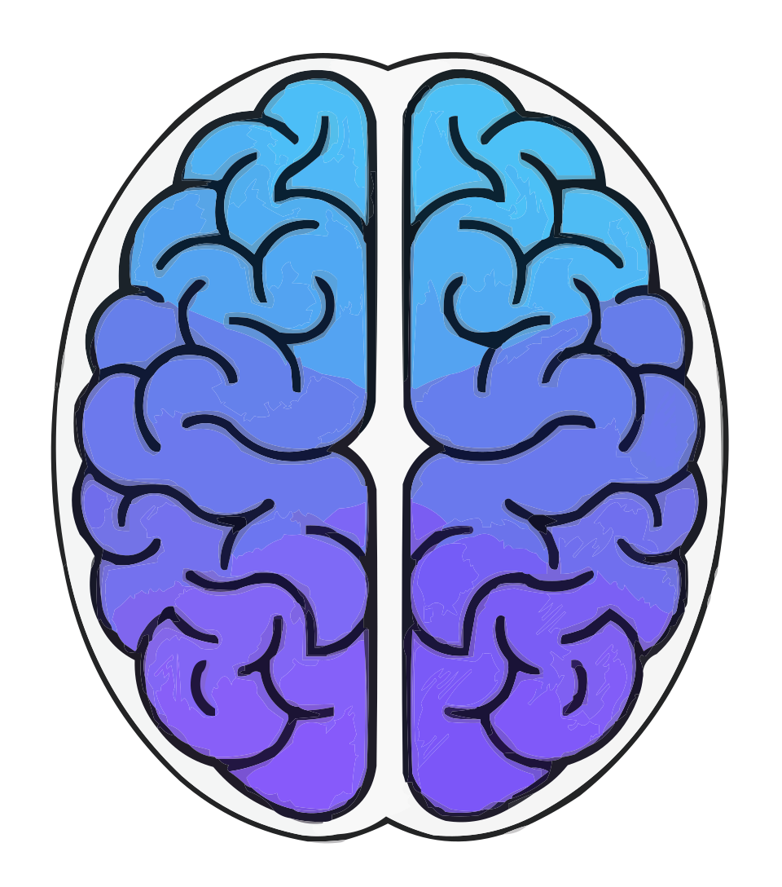

# Kortex Code Assistant

<p align="center">
  
</p>

Code assistant MCP server for Kotlin Multiplatform (KMP) and Compose Multiplatform (CMP) coding assistant.

## Overview

Kortex is an MCP (Model Context Protocol) server that provides AI coding assistants with advanced capabilities for working with Kotlin Multiplatform and Compose Multiplatform projects. It combines LSP-based symbolic code analysis with project-aware navigation, cross-platform understanding, and intelligent code editing.

## Project Status

**Overall Status**: 93/134 tasks complete (69%)

### Completed Features
- ✅ **LSP Symbol Navigation** (User Story 1)
- ✅ **Cross-Platform Understanding** (User Story 2)
- ✅ **Project Onboarding** (User Story 3)
- ✅ **Editing Mode** (User Story 7)
- ✅ **Memory System** (User Story 4)
- ✅ **Interactive User Elicitation** (User Story 5)
- ✅ **Planning Mode** (User Story 6)

### Upcoming Features
- 🚧 **CMP UI Pattern Recognition** (User Story 8)
- 🚧 **Polish & Cross-Cutting** (Phase 11)

### MVP Status
- **MVP Completion**: 100% (4 of 4 P1 stories done)

### Key Features

- **LSP-Based Symbol Navigation**: Search, navigate, and analyze code symbols across all KMP source sets (commonMain, androidMain, iosMain, etc.)
- **Cross-Platform Understanding**: Navigate between Kotlin, Swift, and Objective-C code with full interop awareness
- **Project Onboarding**: Automatically detect and configure KMP/CMP projects with dependencies and source sets
- **Symbolic Code Editing**: Precise code modifications using symbol-level operations via LSP
- **Memory System**: Store and retrieve project-specific knowledge, patterns, and preferences
- **Planning Mode**: Create and refine specifications with SpecKit integration
- **User Elicitation**: Interactive questioning to resolve ambiguities in requirements (requires client elicitation support*)
- **CMP Pattern Recognition**: Understand Compose Multiplatform-specific patterns (composables, navigation, state management)

*\* User Elicitation requires the MCP client to support the elicitation capability. If the client doesn't support elicitation, the tools will return a helpful message instead of failing.*

## Documentation

- [User Guide](docs/README.md): Detailed installation and usage instructions.
- [API Documentation](docs/API.md): Complete reference for all MCP tools.
- [Contributing](CONTRIBUTING.md): Guidelines for contributing to Kortex.

## Setup

```bash
# Create virtual environment
uv venv

# Activate virtual environment
source .venv/bin/activate  # On macOS/Linux
# or
.venv\Scripts\activate  # On Windows

# Install dependencies
uv pip install -e ".[dev]"
```

## Usage

### Running as MCP Server

```bash
python -m kortex_mcp.server
```

### Configuration in Claude Desktop

Add to your Claude Desktop configuration (`~/Library/Application Support/Claude/claude_desktop_config.json` on macOS):

```json
{
  "mcpServers": {
    "kortex": {
      "command": "python",
      "args": ["-m", "kortex_mcp.server"],
      "cwd": "/path/to/kortex"
    }
  }
}
```

## Development

### Running Tests

```bash
# Run all tests
pytest

# Run with coverage
pytest --cov=src/kortex_mcp --cov-report=html

# Run specific test file
pytest tests/test_server.py
```

### Type Checking

```bash
mypy src/kortex_mcp
```

### Linting

```bash
ruff check src/ tests/
ruff format src/ tests/
```

## Architecture

```
src/kortex_mcp/
├── server.py         # FastMCP server initialization
├── tools/            # MCP tool implementations
├── lsp/              # LSP client and language server managers
├── analyzers/        # Code analysis (KMP, CMP patterns)
├── models/           # Data models and types
├── storage/          # Persistence layer (memory, project config)
└── utils/            # Utilities (logging, file operations, async helpers)
```

## Requirements

- Python 3.10+
- Kotlin Language Server (for Kotlin LSP)
- SourceKit-LSP (for Swift LSP, optional)
- clangd (for Objective-C LSP, optional)

## License

MIT

